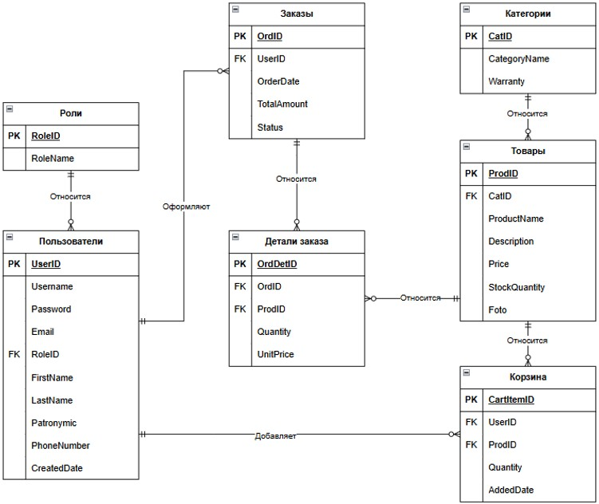
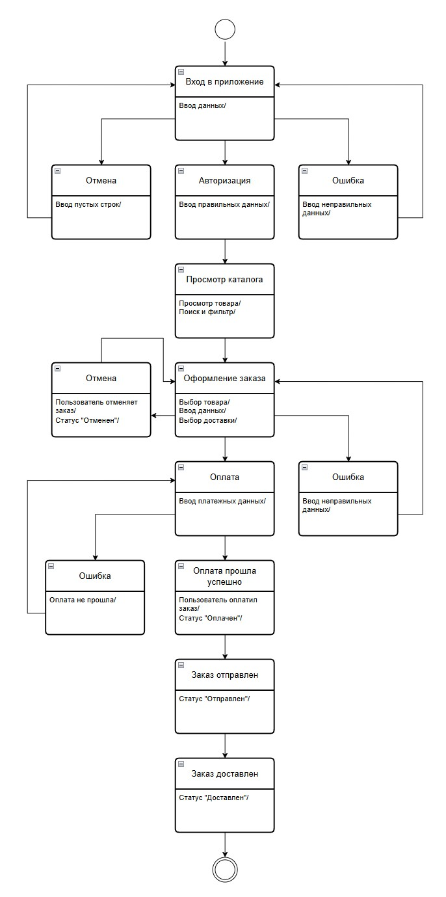
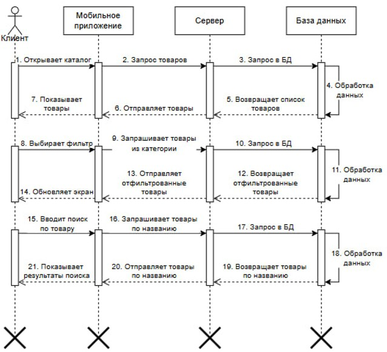
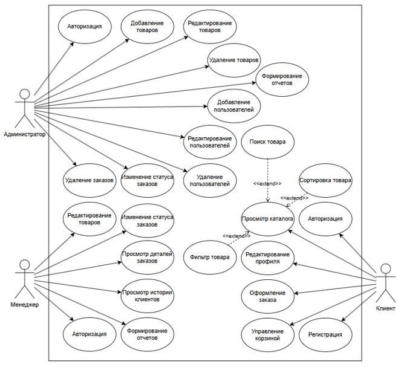

# 🍏 AppleStore — Client-Server System

**Red Diploma Graduation Project**  
*Information Systems and Programming*

## 📌 Overview

AppleStore is a complete client-server e-commerce system.  
It includes:

- **WPF Desktop Application** (Admin & Manager panels)
- **Self-written REST API Server** (C# / HttpListener)
- **Android Mobile Client** (Java / REST API)
- **MS SQL Server Database** (with transactions, stored procedures)

---

## ⚙️ Tech Stack

| Component       | Technologies |
|-----------------|--------------|
| Backend         | C#, .NET Framework, HttpListener, ADO.NET |
| Desktop Client  | C#, WPF, XAML, MVVM |
| Mobile Client   | Java, Android SDK, REST API |
| Database        | MS SQL Server (T-SQL, Transactions, Stored Procedures) |
| Reporting       | Word (DOCX), Excel (XLSX) |
| Version Control | Git |

---

## ✨ Key Features

- Role-based access (Admin / Manager / Customer)
- Full CRUD for products, users, and orders
- Shopping cart with stock validation
- Order processing with SQL transactions
- Email notifications (SMTP)
- Report generation in Word & Excel
- REST API with JSON serialization
- Product image serving

---

## 🚀 How to Run

### 1. Clone the repository
```bash
git clone https://github.com/CSharpInvokeR/AppleStore.git
```

### 2. Database setup
- Run the SQL script (if included) to create the database.
- Update connection string in `appsettings.json`.

### 3. Run the server
- Open `AppleStore.sln` in Visual Studio.
- Build & run the project.

### 4. Run the desktop client
- Make sure the server is running.
- Launch the WPF app from VS.

### 5. Run the Android client
- Open Android project in Android Studio.
- Update server IP address.
- Build & run on emulator or real device.

---

## 📁 Project Structure

```
AppleStore/
├── AndroidApp/                          # Android client
│   ├── app/                             # Source code
│   └── ...                              # Gradle files
├── AppleStore/                          # Main C# project
│   ├── Models/                          # Data models
│   ├── Pages/                           # WPF pages
│   ├── Resources/                       # Images, icons
│   ├── Converters/                      # Value converters
│   ├── Helpers/                         # Database & email helpers
│   ├── Styles/                          # WPF styles
│   ├── App.xaml                         # Application resources
│   └── MainWindow.xaml                  # Login window
├── Database/                            # SQL scripts
│   └── AppleStore.sql                   # Database schema
├── docs/                                # Documentation
│   └── diagrams/                        # UML diagrams
├── AppleStore.sln                       # Solution file
├── .gitignore                           # Ignored files
└── README.md                            # This file
```

---

## 📬 Contact

- **GitHub:** [CSharpInvokeR](https://github.com/CSharpInvokeR)

---

## 🇷🇺 Русский

### 📌 Описание

AppleStore — это клиент-серверная система интернет-магазина, разработанная в качестве дипломного проекта.

Включает:
- **Десктопное приложение на WPF** (панели администратора и менеджера)
- **Самостоятельно написанный REST API сервер** (C# / HttpListener)
- **Мобильное приложение для Android** (Java / REST API)
- **Базу данных MS SQL Server** (транзакции, хранимые процедуры)

---

### ⚙️ Технологии

| Компонент       | Технологии |
|-----------------|------------|
| Бэкенд          | C#, .NET Framework, HttpListener, ADO.NET |
| Десктоп-клиент  | C#, WPF, XAML, MVVM |
| Мобильный клиент| Java, Android SDK, REST API |
| База данных     | MS SQL Server (T-SQL, транзакции, хранимые процедуры) |
| Отчёты          | Word (DOCX), Excel (XLSX) |
| Контроль версий | Git |

---

### ✨ Возможности

- Разделение ролей (Администратор / Менеджер / Клиент)
- Полный CRUD для товаров, пользователей и заказов
- Корзина с проверкой наличия товаров
- Обработка заказов с транзакциями
- Email-уведомления (SMTP)
- Генерация отчётов в Word и Excel
- REST API с JSON-сериализацией
- Отдача изображений товаров

---

### 🚀 Как запустить

1. Клонируйте репозиторий
```bash
git clone https://github.com/CSharpInvokeR/AppleStore.git
```

2. Настройка базы данных
- Запустите SQL-скрипт, если он есть.
- Обновите строку подключения в `appsettings.json`.

3. Запуск сервера
- Откройте `AppleStore.sln` в Visual Studio.
- Соберите и запустите проект.

4. Запуск десктоп-клиента
- Убедитесь, что сервер запущен.
- Запустите WPF-приложение из Visual Studio.

5. Запуск Android-клиента
- Откройте Android-проект в Android Studio.
- Обновите IP-адрес сервера.
- Соберите и запустите.

---

### 📁 Структура проекта

```
AppleStore/
├── AndroidApp/                          # Android-клиент
│   ├── app/                             # Исходный код
│   └── ...                              # Файлы Gradle
├── AppleStore/                          # Основной C# проект
│   ├── Models/                          # Модели данных
│   ├── Pages/                           # WPF-страницы
│   ├── Resources/                       # Изображения, иконки
│   ├── Converters/                      # Конвертеры для привязок
│   ├── Helpers/                         # Хелперы для БД и email
│   ├── Styles/                          # Стили WPF
│   ├── App.xaml                         # Ресурсы приложения
│   └── MainWindow.xaml                  # Окно входа
├── Database/                            # SQL-скрипты
│   └── AppleStore.sql                   # Схема базы данных
├── docs/                                # Документация
│   └── diagrams/                        # UML-диаграммы
├── AppleStore.sln                       # Файл решения
├── .gitignore                           # Игнорируемые файлы
└── README.md                            # Этот файл
```

---

### 📬 Контакты

- **GitHub:** [CSharpInvokeR](https://github.com/CSharpInvokeR)
- **Локация:** Россия


---
### 📐 Диаграммы системы

ER-диаграмма: Схема базы данных.


Диаграмма состояний: Жизненный цикл заказа.


Диаграмма последовательности: Взаимодействие клиента и сервера.


Диаграмма вариантов использования: Функционал по ролям.

